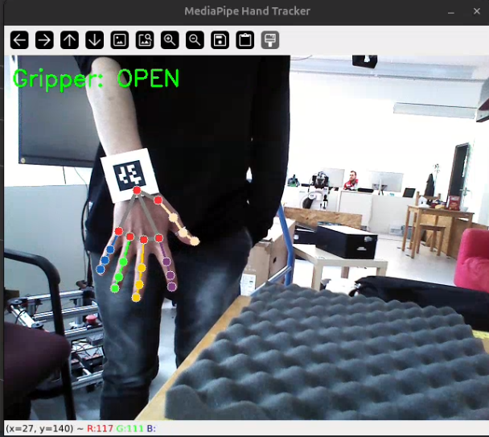
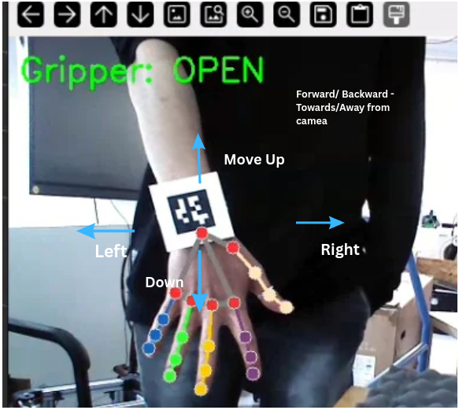
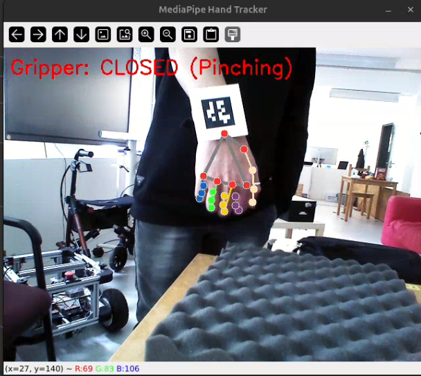
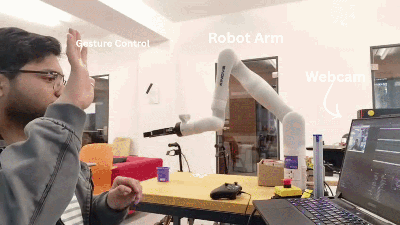
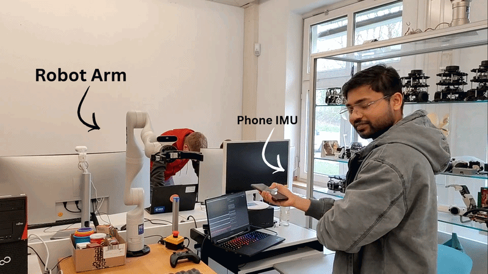

# Teleoperation of Robotic Arm (7DOF with Robotiq Gripper) AprilTag-Based 
Real-time teleoperation of a **Kinova Gen3 (7-DOF)** robotic arm using
**AprilTag tracking**, **MediaPipe hand gestures**, and **ROS2 Jazzy**.

In this project report, we have explored algorithms for 3D spatial tracking and robotic teleoperation and tested with 96 random people to study their hand movement and how they will teleoperate. We utilized a Kinova Gen3 robotic arm and a standard RGB camera setup to track AprilTag fiducial markers, along with the following associated control modules: the state estimation module, which extracts the absolute 3D Cartesian coordinates, orientation vectors (e.g., Roll, Pitch, Yaw), and the real-time calculated velocities of the operator's hand movements; and the ROS 2 filtering pipeline, which provides the exponential moving average (EMA) algorithms and deadzone thresholds required for smooth, Gimbal Lock-free kinematic control.

## 🎬 Demo Apriltag Based


![Full_Video_On_Github_High_Quality] (https://github.com/nirbhayborikar/Kinnova_Gen3_Dof_7_Teleoperation/blob/teleop_markerbased/media/videos/apriltag_teleop_human_hand_tracking.mp4)

> If video doesn't load above, [watch on Google Drive](https://drive.google.com/file/d/1Zj7HWqPut_pNBBrGEh6CWhcCuvjJqi9f/view?usp=sharing)
---

## ✨ Features

-   Kinova Gen3 (7-DOF) teleoperation
-   AprilTag-based workspace tracking
-   MediaPipe hand gesture recognition
-   ROS2 Jazzy + Zenoh DDS communication
-   Containerized deployment using Docker Compose
-   Astra camera + webcam support
-   Modular multi-container architecture

## 📋 Prerequisites

-   Ubuntu 22.04/24.04
-   Docker + Docker Compose
-   X11 display server
-   Astra camera or webcam
-   Kinova Gen3 robot 
-   Connect to iki_robolab wifi network

## 🚀 Setup & Installation  Docker Recommended

### Step 1: Install Docker

```bash
sudo apt update && sudo apt upgrade -y

sudo apt install -y ca-certificates curl gnupg lsb-release

sudo mkdir -p /etc/apt/keyrings
curl -fsSL https://download.docker.com/linux/ubuntu/gpg | \
  sudo gpg --dearmor -o /etc/apt/keyrings/docker.gpg

echo \
  "deb [arch=$(dpkg --print-architecture) signed-by=/etc/apt/keyrings/docker.gpg] \
  https://download.docker.com/linux/ubuntu \
  $(lsb_release -cs) stable" | \
  sudo tee /etc/apt/sources.list.d/docker.list > /dev/null

sudo apt update
sudo apt install -y docker-ce docker-ce-cli containerd.io docker-buildx-plugin docker-compose-plugin

# Verify installation
sudo docker run hello-world
```

### Step 2: Allow GUI Access for Docker

```bash
echo 'xhost +local:docker > /dev/null 2>&1' >> ~/.bashrc
source ~/.bashrc
```
### Step 3: Clone Repository

```bash
git clone https://github.com/nirbhayborikar/Kinnova_Gen3_Dof_7_Teleoperation.git
```

### Step 4: Build & Run

```bash
cd Kinnova_Gen3_Dof_7_Teleoperation/kinnova_gen3_7_DOF_webcam_teleop/ros2_ws/src/docker
docker compose -f teleop_astra_marker.yml up
```

This single command will:
1. Build the Docker image (ROS2 Jazzy + MoveIt2 + MediaPipe + Apriltag + Astra Camera IMage)
2. Launch the kortex arm from kortex_demo folder (for this contact University)
3. Connect the astra camera
4. Open the camera window with hand tracking overlay

## 🏗 Architecture


Astra Camera → AprilTag Detection → Gesture Tracking → Workspace Mapping
→ Kinova Teleop → Kinova Gen3


## 🎮 Operating Instructions
Sit facing the camera. Show both hands — you'll see landmark points and connections drawn on your hands in the camera window.

### Controls

| Gesture | Action |
|---------|--------|
| Open finger/ fist | Open gripper |
| Pinch thumb + index finger | Close gripper |
| Close fist | Close gripper |
| Move hand left/right | Arm moves laterally (Y-axis) |
| Move hand up/down | Arm moves vertically (Z-axis) |
| Move hand toward/away from camera | Arm moves forward/backward (X-axis) |


### Visual Guides

| Action | Image |
|--------|-------|
| Human hand in Angle |  |
| Move Hand in Direction |  |
| Gripper Close (fist) |  |
| Gripper Open (fist open) |  |


## Node Details

**1. webcam_apriltag_node.py** — The Main Code Pipeline ([source](https://github.com/nirbhayborikar/Kinnova_Gen3_Dof_7_Teleoperation/blob/teleop_markerbased/kinnova_gen3_7_DOF_webcam_teleop/ros2_ws/src/stage_1/webcam_tag_detection/webcam_tag_detection/webcam_apriltag_node.py))

Captures webcam feed/ feed from astra camera, tracks hands using MediaPipe, detect AprilTag using tf2 and applies 3-stage noise filtering (dead zone → velocity clamping → EMA smoothing), maps AprilTag based hand positions to robot workspace, detects pinch gesture for gripper control, and publishes target poses and gripper commands at 30Hz.

**2. apriltag.launch.py** — AprilTag Detection Launcher ([source](https://github.com/nirbhayborikar/Kinnova_Gen3_Dof_7_Teleoperation/blob/teleop_markerbased/apriltag/apriltag_ros/launch/apriltag.launch.py))

Launches the apriltag_ros detection node and configures it dynamically at runtime. This file acts as a wrapper around apriltag_node, allowing camera topics, parameter files, image transport methods, and naming prefixes to be changed without modifying source code.

This file:
1. Creates an apriltag_ros detection node
2. Loads detector settings from tags_36h11.yaml
3. Subscribes to camera image and camera calibration topics
4. Remaps camera topics to match the active camera source (Astra/webcam)
5. Supports namespace prefixes for running multiple detectors simultaneously
6. Supports simulation time (use_sim_time)
7. Supports different image transport types (raw, compressed, etc.)
8. Dynamically builds node names using OpaqueFunction at launch time

**3. astra.launch.py** — Hand Tracking ([source](https://github.com/nirbhayborikar/Kinnova_Gen3_Dof_7_Teleoperation/blob/teleop_markerbased/astra/astra_camera/launch/astra.launch.py))

Launches and configures the Orbbec Astra depth camera node inside a dedicated ROS2 namespace, exposes many runtime parameters through launch arguments, and starts the camera driver responsible for publishing color images, depth images, infrared streams, point clouds, camera calibration data, and TF transforms. This file acts as the central camera configuration layer and allows changing camera behavior (resolution, FPS, point cloud generation, synchronization, QoS, etc.) without modifying source code.

Pipeline of astra.launch.py:

``` text
astra.launch.py
    │
    ├── Declare launch arguments
    │       • Camera name / namespace
    │       • Resolution (640x480 default)
    │       • FPS settings (30Hz)
    │       • Enable/disable color, depth, IR
    │       • Point cloud options
    │       • TF publishing options
    │       • Synchronization settings
    │
    ├── Convert arguments → parameter dictionary
    │
    ├── Create namespace group
    │       • PushRosNamespace(camera)
    │
    └── Launch astra_camera_node
            • Connect to Astra sensor
            • Initialize streams
            • Publish camera topics
            • Publish camera TF frames
            • Publish point clouds
```

---

## 📡 ROS Topics

-   /camera/color/image_raw
-   /camera/color/camera_info
-   /tag_detections
-   /tf
-   /joint_states

## 📁 Repository Structure

``` text
kinnova_gen3_7_DOF_webcam_teleop/
├── ros2_ws
    └── src/
        ├── docker/
        │   ├── Dockerfile              # ROS2 jazzy + ROS2 controller + MediaPipe
        │   ├── teleop_astra_marker.yml # One-command build & run
        │   └── zenoh_config.json5      # zenoh router config file
        └── stage_1/
          │── webcam_tag_detection
            └── webcam_tag_detection
                ├── __init__.py
                ├── webcam_apriltag_node.py
apriltag
├── docker/
│   ├── Dockerfile              # AprilTag
astra
├── docker/
│   ├── Dockerfile              # Astra 
README.md
```


## Other Methods

### 🎬 Demo Gesture Based



![Full_Video_On_Github_High_Quality] (https://github.com/nirbhayborikar/Kinnova_Gen3_Dof_7_Teleoperation/blob/teleop_markerbased/media/videos/gesture_control.mp4)

> If video doesn't load above, [watch on Google Drive](https://drive.google.com/file/d/1imUobW2JqoDp8IXXe3lIxR-mGfJ9kDpR/view?usp=sharing)

### Gesture Control: Build & Run

```bash
cd Kinnova_Gen3_Dof_7_Teleoperation/kinnova_gen3_7_DOF_webcam_teleop/ros2_ws/src/docker
docker compose -f gesture_based.yml up
```
###  Gesture Control Node

**gesture_control_node.py** — The Main Code Pipeline ([source](https://github.com/nirbhayborikar/Kinnova_Gen3_Dof_7_Teleoperation/blob/teleop_markerbased/kinnova_gen3_7_DOF_webcam_teleop/ros2_ws/src/stage_1/gesture_control/gesture_control/gesture_control_node.py))

This node (/twist_teleop_publisher) provides a fully markerless, vision-based control interface using a standard 2D webcam and Google's MediaPipe framework. It captures the video feed at 30Hz, tracks both hands simultaneously, and extracts wrist coordinates, rotation, and discrete gestures (fist, pinch, open hand). It implements a strict "dead-man's switch" safety architecture: robot motion is only authorized when the operator's right fist is closed. Hand movements are mapped to Cartesian velocities via a smart-switching dual-hand kinematics model, smoothed through a 3-stage filtering pipeline (dead-zone → Exponential Moving Average $\alpha = 0.4$ → velocity clamping). Furthermore, it handles asynchronous action goals to control the Robotiq gripper, monitors the end-effector TF2 frames, and generates a live OpenCV diagnostic overlay for the operator.

## ✋ Operating Instructions: MediaPipe Gesture Control

Once the node is running, it will open a live camera feed window. Ensure both your left and right hands are visible in the camera frame.

1. The Safety Enable Switch (Right Hand)

    To Move: You must close your right hand into a fist. This acts as an active safety switch. If your right hand is open (or leaves the camera frame), the robot will instantly stop and ignore all other commands.

2. Robot Navigation (Motion Control)

    X-Axis (Forward/Backward): While holding a right fist, move your right hand UP or DOWN in the camera frame.

    Y-Axis (Left/Right): While holding a right fist, move your right hand LEFT or RIGHT. (Note: If your right hand is moving vertically, you can use your left hand's horizontal movement as a backup Y-axis control).

    Z-Axis (Up/Down): While holding a right fist, move your left hand UP or DOWN in the camera frame.

    End-Effector Roll: Rotate your right wrist clockwise or counterclockwise.

3. Gripper Control (Left Hand)
    (Note: Gripper commands only register while the right fist is closed).

    Close Gripper: Form a Pinch or a Closed Fist with your left hand.

    Open Gripper: Fully open your left hand.

4. Emergency Stop

    Simply open your right hand. The system will instantly publish a zero-velocity Twist command and apply the brakes, regardless of what your left hand is doing.

    You can also press 'Q' while focused on the camera window to safely shut down the node.


### 🎬 Demo Phone IMU Based



![Full_Video_On_Github_High_Quality] (https://github.com/nirbhayborikar/Kinnova_Gen3_Dof_7_Teleoperation/blob/teleop_markerbased/media/videos/imubased.mp4)

> If video doesn't load above, [watch on Google Drive](https://drive.google.com/file/d/1vcgR2-tFVCopmUTpgAxHbNPJVyZgdvpt/view?usp=sharing)

### IMU Based Control: Build & Run

```bash
cd Kinnova_Gen3_Dof_7_Teleoperation/kinnova_gen3_7_DOF_webcam_teleop/ros2_ws/src/docker
docker compose -f imu_based.yml up
```
### IMU Control Node

**sensagram_twist_final.py** — The Main Code Pipeline ([source](https://github.com/nirbhayborikar/Kinnova_Gen3_Dof_7_Teleoperation/blob/teleop_markerbased/kinnova_gen3_7_DOF_webcam_teleop/ros2_ws/src/stage_1/gesture_control/gesture_control/sensagram_twist_final.py))

This node (/udp_twist_teleop_publisher) establishes a non-blocking UDP socket on port 5005 to receive android.sensor.rotation_vector JSON packets streamed over the local Wi-Fi from the Sensagram smartphone application. It converts incoming quaternions into Euler angles, performs a continuous 3-axis "Tare" operation against the initial phone orientation, and maps phone tilt directly to Cartesian robot velocities. To ensure safe operation, it implements a 3-stage noise filter (smooth dead-zone → Exponential Moving Average smoothing $\alpha = 0.1$ → velocity clamping) and a critical safety watchdog timer that slams the robot's brakes if a UDP packet is delayed by more than 0.2 seconds. It publishes filtered commands to /twist_controller/commands at 30Hz and visualizes the commanded velocity vector as an arrow in RViz2.

### 📱 Mobile Application Requirement: Sensagram (IMU Control)

If you intend to use the **IMU-Based Control** modality, you must install the open-source **Sensagram** application on your Android smartphone. This app streams your phone's internal accelerometer and gyroscope data over your local network to control the robot's orientation.

**1. Download & Install**
* Download Sensagram via F-Droid: [Sensagram on F-Droid](https://f-droid.org/packages/com.github.umer0586.sensagram/)

**2. Network Configuration**
* Your smartphone and the host PC running the robot's Docker containers **must be connected to the exact same Wi-Fi network (subnet)**.

**3. App Configuration & Streaming**
1. Open the Sensagram app and navigate to **Settings**.
2. Enter the **IP Address** of your host PC (the computer connected to the robot).
3. Set the **Port No.** to `5005`.
4. Navigate to the **Sensors** tab and toggle ON **Rotation Vector Non-wakeup**.
5. Return to the **Home** screen and press the **Stream (->)** button to begin transmitting IMU data to the ROS 2 middleware.

> **Note on Data Rates:** The Sensagram app may send IMU data at a higher frequency than the robot's read rate. Ensure your Zenoh/DDS bridge is running correctly so the host machine can properly ingest the UDP stream without backlog.


## 🎮 Operating Instructions: Sensagram IMU Control

Once the node is running and the Sensagram app is actively streaming on your local network, the robot is controlled purely by tilting your smartphone in 3D space.

1. Tare (Initialization)

    Hold your phone perfectly still in your hand when starting the stream. The node will log --- TARE COMPLETE ---. This initial phone orientation becomes your absolute "Zero" position.

2. Kinematic Controls

    Move Forward/Backward (Robot X-Axis): Tilt the phone's pitch forward or backward.

    Move Left/Right (Robot Y-Axis): Rotate the phone's yaw clockwise or counterclockwise.

    Move Up/Down (Robot Z-Axis): Tilt the phone's roll left or right.

3. Dead-zone & Safety

    Dead-zone: The system requires a deliberate tilt of approximately 11.5 degrees (dead_zone: 0.29 radians) before the robot will move. This prevents accidental hand tremors from causing jitter.

    Emergency Stop: If you need the robot to stop instantly, either return the phone to the flat "Tare" position, or simply pause the Sensagram stream. The 0.2-second Watchdog Timer will instantly publish a zero-velocity Twist command.

## Comparison Between Methods

| Criterion | AprilTag Marker (Wearable Tag) | MediaPipe Hand Gesture | IMU Based Control |
| :--- | :--- | :--- | :--- |
| **Sensor Required** | Standard RGB camera | Standard RGB camera | IMU / wearable sensor |
| **Marker / Device** | AprilTag wristband | Bare hand (markerless) | IMU worn on wrist/arm |
| **Pose Estimation** | Full 6 DoF (TF2) | 21 point landmarks | Orientation only |
| **Depth Information** | Via TF2 transform | Limited (2D only) | Yes (integration) |
| **Occlusion Sensitivity** | High (watchdog mitigates) | Moderate | Low (body worn) |
| **Setup Complexity** | Low (print + attach) | Very low (none) | Moderate (calibrate IMU) |
| **Suitable for typical age group** | Yes (76.2% success) | Yes (gesture based) | Limited (calibration needed) |
| **Primary Control Signal** | Cartesian velocity | Gesture classification | Orientation angle |
| **Safety Mechanisms** | Watchdog, geofence, EMA filter, deadzone | Confidence threshold, deadzone filter | Drift correction, low pass filter |
| **Control Latency / Data Updates** | Low (30 Hz loop) | Low (30 Hz loop) | 100–1000 Hz or higher (faster response) |
| **Cost of Setup** | Very low (paper tag) | Zero (software only) | Moderate (hardware) |
| **Robustness to Lighting** | Moderate (CLAHE helps) | Moderate | High (sensor independent) |

*Table: Comparison of Teleoperation Approaches Implemented on the Kinova Gen3 Platform*


## 🚀 Future Improvements

-   Dynamic workspace calibration
-   Multiple AprilTag support
-   Depth integration
-   Safety zones

## 🚀 For Depth Understanding

-   Follow this report ->

