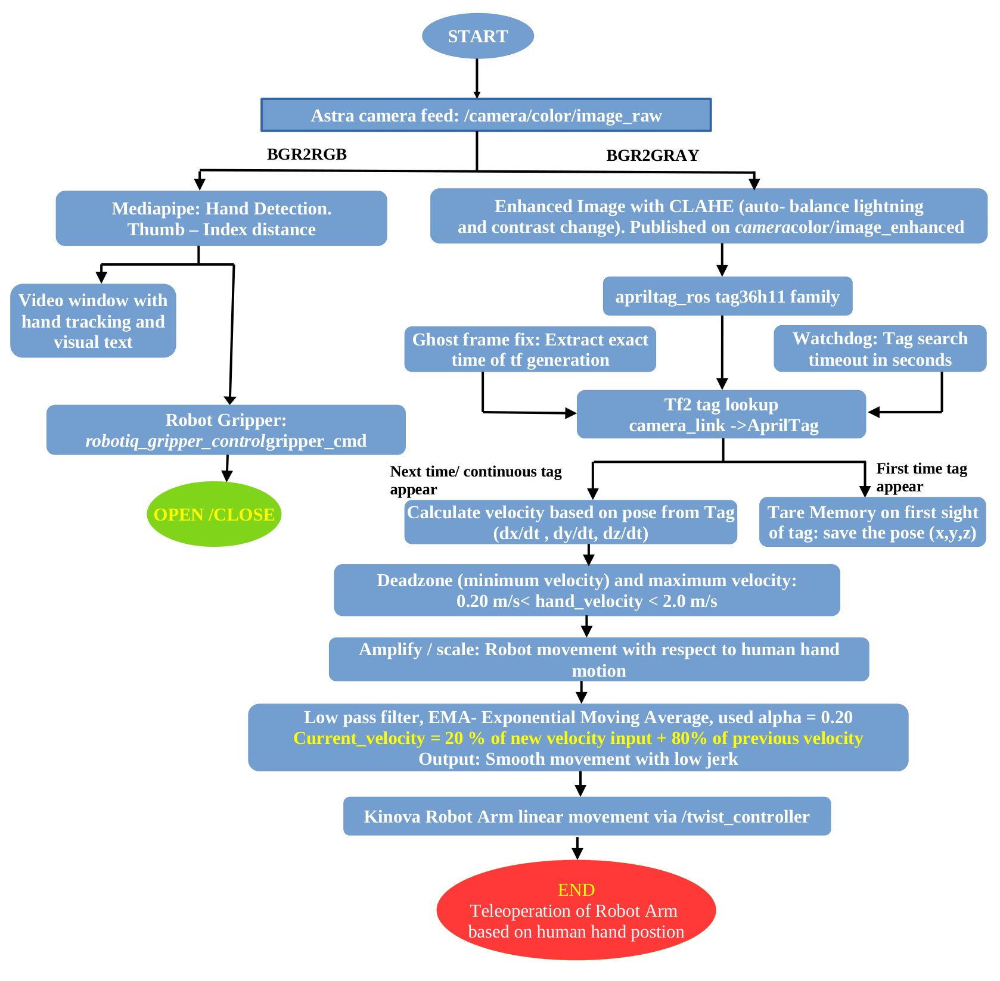

# Teleoperation of Robotic Arm (7DOF with Robotiq Gripper) AprilTag-Based 
Real-time teleoperation of a **Kinova Gen3 (7-DOF)** robotic arm using
**AprilTag tracking**, **MediaPipe hand gestures**, and **ROS2 Jazzy**.

In this project report, we have explored algorithms for 3D spatial tracking and robotic teleoperation and tested with 96 random people to study their hand movement and how they will teleoperate. We utilized a Kinova Gen3 robotic arm and a standard RGB camera setup to track AprilTag fiducial markers, along with the following associated control modules: the state estimation module, which extracts the absolute 3D Cartesian coordinates, orientation vectors (e.g., Roll, Pitch, Yaw), and the real-time calculated velocities of the operator's hand movements; and the ROS 2 filtering pipeline, which provides the exponential moving average (EMA) algorithms and deadzone thresholds required for smooth, Gimbal Lock-free kinematic control.

## 🎬 Demo


![Full_Video_On_Github_High_Quality] (https://github.com/user-attachments/assets/a066718c-373d-490d-a892-551655c1226c)

> If video doesn't load above, [watch on Google Drive](https://drive.google.com/file/d/1Zj7HWqPut_pNBBrGEh6CWhcCuvjJqi9f/view?usp=sharing)
---

## ✨ Features

-   Kinova Gen3 (7-DOF) teleoperation
-   AprilTag-based workspace tracking
-   MediaPipe hand gesture recognition
-   ROS2 Jazzy + Zenoh DDS communication
-   Containerized deployment using Docker Compose
-   Astra camera + webcam support
-   Modular multi-container architecture

## 📋 Prerequisites

-   Ubuntu 22.04/24.04
-   Docker + Docker Compose
-   X11 display server
-   Astra camera or webcam
-   Kinova Gen3 robot 
-   Connect to iki_robolab wifi network

## 🚀 Setup & Installation  Docker Recommended

### Step 1: Install Docker

```bash
sudo apt update && sudo apt upgrade -y

sudo apt install -y ca-certificates curl gnupg lsb-release

sudo mkdir -p /etc/apt/keyrings
curl -fsSL https://download.docker.com/linux/ubuntu/gpg | \
  sudo gpg --dearmor -o /etc/apt/keyrings/docker.gpg

echo \
  "deb [arch=$(dpkg --print-architecture) signed-by=/etc/apt/keyrings/docker.gpg] \
  https://download.docker.com/linux/ubuntu \
  $(lsb_release -cs) stable" | \
  sudo tee /etc/apt/sources.list.d/docker.list > /dev/null

sudo apt update
sudo apt install -y docker-ce docker-ce-cli containerd.io docker-buildx-plugin docker-compose-plugin

# Verify installation
sudo docker run hello-world
```

### Step 2: Allow GUI Access for Docker

```bash
echo 'xhost +local:docker > /dev/null 2>&1' >> ~/.bashrc
source ~/.bashrc
```
### Step 3: Clone Repository

```bash
git clone https://github.com/nirbhayborikar/Kinnova_Gen3_Dof_7_Teleoperation.git
```

### Step 4: Build & Run

```bash
cd Kinnova_Gen3_Dof_7_Teleoperation/kinnova_gen3_7_DOF_webcam_teleop/ros2_ws/src/docker
docker compose -f teleop_astra_marker.yml up
```

This single command will:
1. Build the Docker image (ROS2 Jazzy + MoveIt2 + MediaPipe + Apriltag + Astra Camera IMage)
2. Launch the kortex arm from kortex_demo folder (for this contact University)
3. Connect the astra camera
4. Open the camera window with hand tracking overlay

## 🏗 Architecture




Astra Camera → AprilTag Detection → Gesture Tracking → Workspace Mapping
→ Kinova Teleop → Kinova Gen3


## 🎮 Operating Instructions
Sit facing the camera. Show both hands — you'll see landmark points and connections drawn on your hands in the camera window.

### Controls

| Gesture | Action |
|---------|--------|
| Open hand | Open gripper |
| Pinch thumb + index finger | Close gripper |
| Close fist | Close gripper |
| Move hand left/right | Arm moves laterally (Y-axis) |
| Move hand up/down | Arm moves vertically (Z-axis) |
| Move hand toward/away from camera | Arm moves forward/backward (X-axis) |


### Visual Guides

| Action | Image |
|--------|-------|
| Human hand in Angle |  |
| Move Forward |  |
| Move Up (pinch) |  |
| Gripper Close (fist) |  |
| Gripper Open |  |
| Arms moving together (Y-direction) |  |


## 📡 ROS Topics

-   /camera/color/image_raw
-   /camera/color/camera_info
-   /tag_detections
-   /tf
-   /joint_states

## 📁 Repository Structure

``` text
kinnova_gen3_7_DOF_webcam_teleop/
├── ros2_ws
    └── src/
        ├── docker/
        │   ├── Dockerfile              # ROS2 jazzy + ROS2 controller + MediaPipe
        │   ├── teleop_astra_marker.yml # One-command build & run
        │   └── zenoh_config.json5      # zenoh router config file
        └── stage_1/
          │── webcam_tag_detection
            └── webcam_tag_detection
                ├── __init__.py
                ├── webcam_apriltag_node.py
apriltag
├── docker/
│   ├── Dockerfile              # AprilTag
astra
├── docker/
│   ├── Dockerfile              # Astra 
README.md
```

## 🚀 Future Improvements

-   Dynamic workspace calibration
-   Multiple AprilTag support
-   Depth integration
-   Safety zones

## 🚀 For Depth Understanding

-   Follow this report ->

