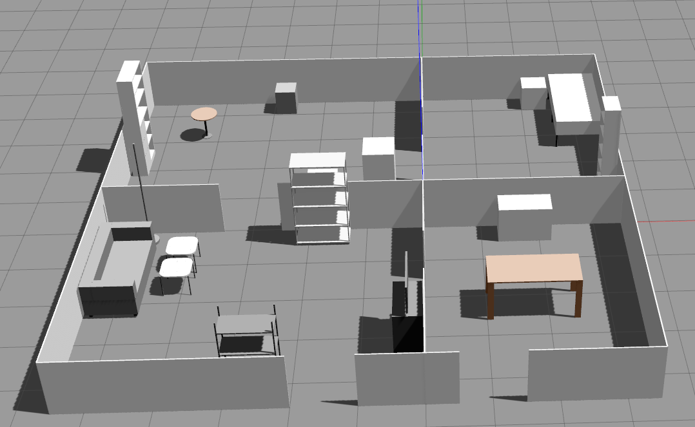

# iki_object_models
This repository contains SDF files for the gazebo simulation.

Just clone the repo and build it with colcon, all the models should be added to your gazebo path.

You can check out some models using docker:
```bash
git submodule update --init --recursive
docker-compose -f docker/build.yml build
docker-compose -f docker/docker-compose.yml up
```

## Models

| Name      | Description                 |
| :-------- | :-------------------------- |
| april_tags_gazebo_classic | AprilTags for gazebo classic simulation   |
| april_tags_gz | AprilTags for gazebo modern simulation (GZ)   |
| barrob | All barrob related models ( robots, ramps )   |
| e_building |  E building and robolab models for gazebo classic  |
| e_building_2024 |  E building and robolab models for gazebo modern  |
| furniture | Quite self explanatory  |
| k_building | K building models for gazbo classic  |
| marker | Alvar marker models for gazebo classic  |
| objects_with_marker | Different object models with alvar markers attached for gazebo classic  |
| robocup_arena | Old robocup arena  |
| robocup_arena_2023 | The robocup 2023 arena for gazebo classic  |
| robocup_2025/arena | The robocup 2025 arena for gazebo modern  |
| test_room | Also quite self explanatory  |
| ycb_models | The YCB models  |

## Worlds

| Name      | Description                 |
| :-------- | :-------------------------- |
| robocup_2025/arena.world.sdf | World containing the robocup 2025 arena  |

### Robocup 2023 Arena


### External 

| Name      | Description                 |
| :-------- | :-------------------------- |
| cob | Care-O-bot simulation models   |
| 3D Gems |  Many furniture models  |
| Example C | Yet another example entry.  |
